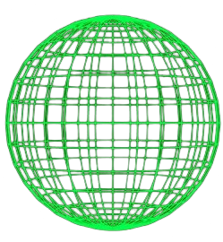
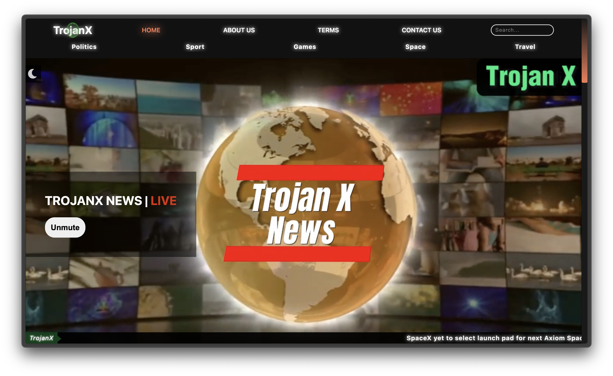

#  TrojanX | Global News Portal Platform

> **Live Demo:** [https://trojanx.vercel.app]

TrojanX is a comprehensive, multi-category digital news platform designed to deliver real-time global updates across diverse sectors. Engineered as a full-scale publication portal, the platform manages high volumes of distinct content types—from breaking geopolitical headlines to deep-dive aerospace features—while maintaining a cohesive and highly navigable user experience. Built entirely with vanilla web technologies, this project demonstrates a strong command of native CSS layout architecture, semantic HTML5, and core DOM manipulation without the use of external frameworks.

## 🍽️ The Content Ecosystem
The platform routes users through dedicated, purpose-built hubs accessible via a persistent navigation system:
* **Politics:** A dedicated feed for geopolitical shifts, government updates, and breaking international affairs.
* **Sport:** A dynamic hub tracking athletic events, featuring high-density listicles for fast-paced updates on major global leagues.
* **Games:** A specialized digital entertainment sector highlighting AAA releases, hardware updates, and developer news.
* **Space:** A visual-heavy category dedicated to aerospace achievements, orbital launches, and institutional updates from organizations like NASA.
* **Travel:** An exploration-focused segment for geographical news, global destination guides, and cultural highlights.

## ✨ Core Features & Functionality
* **Real-Time News Ticker:** A persistent, dynamic ticker built into the header to broadcast live breaking news, keeping the user immediately informed of critical updates across the globe the moment they land on the site.
* **Thematic UI Shifting:** Utilizes dynamic contrast and custom styling to differentiate content hubs. Standard news utilizes a stark, readable light mode, while sectors like the "Games" hub transition into an immersive, dark-themed background with overlay gradients.
* **Asymmetric Content Grids:** Complex, mixed-content grid layouts (like the "Editor's Picks" section) balance dominant lead stories against dense, vertically scrollable lists of secondary updates to maximize information density without clutter.
* **Live Radio Integration:** A dedicated interaction point in the command center allowing users to stream live audio coverage.

## 🧠 Site Architecture
Beyond the dedicated news hubs, the platform includes essential structural architecture to support a professional publication:
* **Home:** The core command center featuring the ticker, mixed-category grids, and the primary content layouts.
* **About Us:** A foundational page detailing the publication's mission, editorial standards, and organizational structure.
* **Contact Us:** A user engagement portal for press inquiries, reader feedback, and tip submissions.

## 🛠️ Technical Stack
* **Markup:** Semantic HTML5 (Optimized for accessibility and structural logical flow)
* **Styling:** Advanced CSS3 (Extensive use of CSS Grid and Flexbox for responsive layouts)
* **Interactivity:** Vanilla JavaScript (ES6) for DOM manipulation and interactive elements like the news ticker.
* **Dependencies:** Zero (100% custom-written architecture).

---
*Developed by [Emad Wagih] — Frontend Web Developer*
